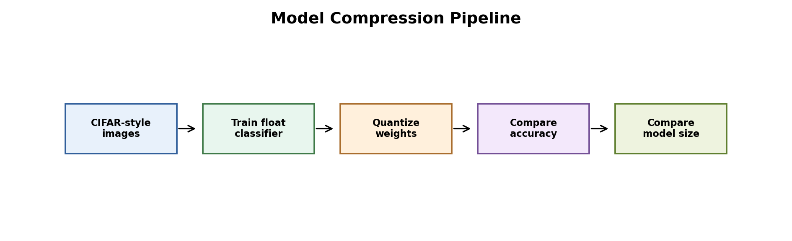
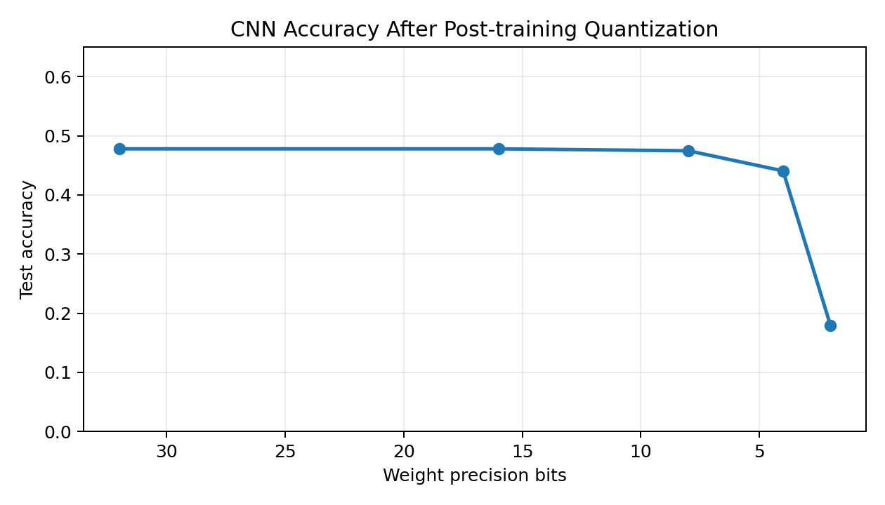
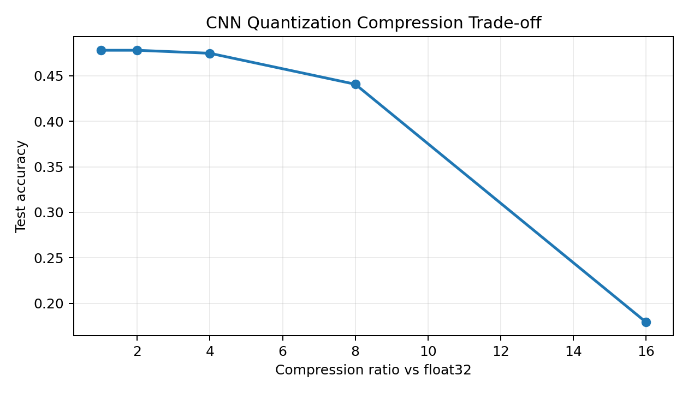

# CIFAR-10 Linear Model Quantization Lab



Figure: train a linear classifier on real CIFAR-10 pixels, quantize the trained weights, and measure the accuracy-size trade-off.

## Motivation

Quantization is useful only if we measure both compression and accuracy. This project uses real CIFAR-10 so the compression result is meaningful and not just a toy demonstration.

## Project Goal

We trained a simple linear classifier on real CIFAR-10 and quantized its weights from float64 storage down to lower precision. The goal was to see when quantization keeps accuracy stable and when it breaks the model.

## Dataset

We used the official CIFAR-10 Python archive. The script downloads the dataset into the ignored `data/` folder.

Experiment subset:

- Training images: 10,000
- Test images: 2,000
- Classes: 10
- Image size: 32x32 RGB
- Features: flattened standardized pixels

## Tools

Python, NumPy, pandas, scikit-learn, and matplotlib.

## Method

We trained an SGD linear classifier with logistic loss. After training, we quantized only the learned weights and intercepts using symmetric uniform quantization. We then reused the same test set to compare accuracy, macro F1, approximate model size, and compression ratio.

## Hyperparameters

| Setting | Value |
|---|---:|
| Model | SGD linear classifier |
| Loss | Logistic loss |
| Max iterations | 100 |
| Alpha | 0.0001 |
| Train images | 10,000 |
| Test images | 2,000 |
| Random seed | 42 |

## Results

| Weight Precision | Accuracy | Macro F1 | Compression Ratio |
|---:|---:|---:|---:|
| 64-bit | 0.3630 | 0.3667 | 1.00 |
| 32-bit | 0.3630 | 0.3667 | 2.00 |
| 16-bit | 0.3630 | 0.3667 | 4.00 |
| 8-bit | 0.3630 | 0.3666 | 8.00 |
| 4-bit | 0.3475 | 0.3524 | 16.00 |
| 2-bit | 0.1080 | 0.0369 | 32.00 |





Result files:

- `results/quantization_metrics.csv`
- `results/experiment_setup.csv`
- `results/accuracy_vs_precision.png`
- `results/compression_accuracy_tradeoff.png`

## Interpretation

The model is weak because it is only a linear classifier on raw CIFAR-10 pixels, but the quantization behavior is meaningful.

Accuracy stayed stable from 64-bit down to 8-bit. At 4-bit, accuracy dropped slightly. At 2-bit, performance collapsed close to the dummy-baseline range. This shows that moderate quantization can preserve a simple model, but very aggressive quantization destroys useful weight information.

## Conclusion

This project demonstrates quantization on a real image dataset. The next step should train a small CNN and compare post-training quantization on convolutional weights, because CNNs are much more appropriate for CIFAR-10 than a linear pixel classifier.

## How To Run

```bash
pip install -r requirements.txt
python 1_real_cifar_linear_quantization.py
```
