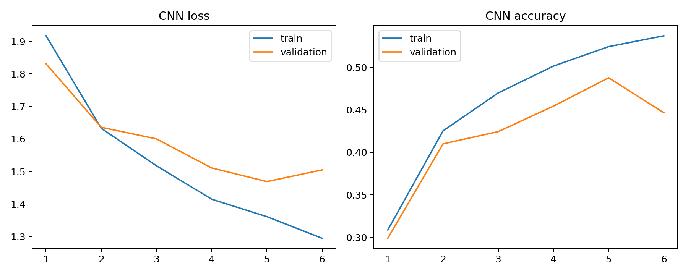

# CIFAR-10 CNN Quantization Lab


Figure: a small CNN is trained on real CIFAR-10, then post-training weight quantization is evaluated.

## Motivation

Quantization should be tested on a model that actually uses image structure. A CNN is more appropriate for CIFAR-10 than a linear pixel classifier, so this project measures compression on convolutional weights.

## Project Goal

We trained a small CNN on real CIFAR-10 and quantized the trained weights to lower precision. The goal was to see how far precision can be reduced before accuracy breaks.

## Dataset

We used the official CIFAR-10 Python archive.

- Training images: 6,000
- Test images: 1,500
- Classes: 10
- Image size: 32x32 RGB

## Tools

Python, NumPy, pandas, PyTorch, scikit-learn metrics, and matplotlib.

## Method

The CNN has three convolution blocks with batch normalization, ReLU, pooling, and a final linear classifier. After training, we applied symmetric post-training quantization to model parameters.

Hyperparameters:

| Setting | Value |
|---|---:|
| Epochs | 6 |
| Optimizer | Adam |
| Learning rate | 0.001 |
| Weight decay | 0.0001 |
| Parameters | 94,986 |

## Results

| Weight Precision | Accuracy | Macro F1 | Compression vs FP32 |
|---:|---:|---:|---:|
| 32-bit | 0.4780 | 0.4539 | 1.00 |
| 16-bit | 0.4780 | 0.4539 | 2.00 |
| 8-bit | 0.4747 | 0.4519 | 4.00 |
| 4-bit | 0.4407 | 0.4067 | 8.00 |
| 2-bit | 0.1793 | 0.1246 | 16.00 |




## Interpretation

Int8 quantization is almost safe here: accuracy changes from 0.4780 to 0.4747. Four-bit quantization still works but loses more accuracy. Two-bit quantization collapses the CNN because too much weight information is removed.

## Conclusion

This project now evaluates quantization on a real CNN. The practical conclusion is clear: 8-bit post-training quantization is strong for this model, while 2-bit quantization is too aggressive.

## How To Run

```bash
pip install -r requirements.txt
python 1_cifar10_cnn_quantization.py
```
